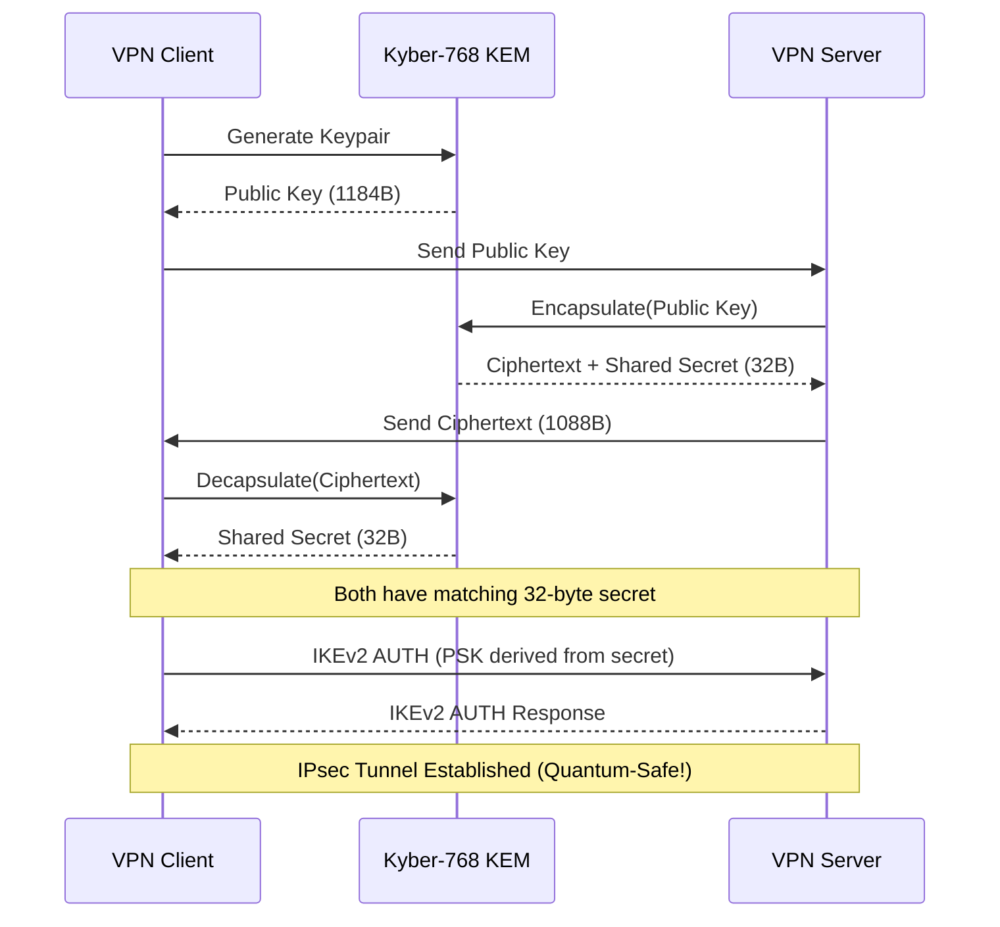

# Post-Quantum Cryptography Integration in IPsec VPN

[](LICENSE)
[](https://pq-crystals.org/kyber/)
[](https://www.strongswan.org/)

> **A production-aligned Proof-of-Concept demonstrating quantum-resistant key exchange in enterprise VPN infrastructure**

## 📋 Overview

This project demonstrates how **NIST-standardized Post-Quantum Cryptography** (Kyber-768) can be integrated into existing **IPsec VPN** systems without requiring a complete protocol redesign. The implementation uses **StrongSwan** and **liboqs** to create a quantum-safe VPN tunnel.

### 🎯 Key Achievements

- ✅ **Quantum-Safe Key Exchange**: Implemented Kyber-768 KEM (NIST standardized)
- ✅ **VPN Integration**: Integrated with StrongSwan IPsec/IKEv2
- ✅ **No Protocol Redesign**: Uses standard PSK authentication
- ✅ **Production-Aligned**: Clear migration path for enterprise deployment

---

## 🏗️ Architecture
```
┌─────────────────────────────────────────────────────────┐
│                    VPN Client                           │
│  ┌──────────────┐         ┌─────────────────────────┐  │
│  │   Kyber-768  │────────▶│   Shared Secret (32B)   │  │
│  │ Key Exchange │         └──────────┬──────────────┘  │
│  └──────────────┘                    │                  │
│                                      ▼                  │
│                              ┌───────────────┐          │
│                              │  PSK for IKE  │          │
│                              └───────┬───────┘          │
└──────────────────────────────────────┼──────────────────┘
                                       │
                              ═════════╪═══════════
                                IPsec/IKEv2 Tunnel
                              ═════════╪═══════════
                                       │
┌──────────────────────────────────────┼──────────────────┐
│                    VPN Server         │                  │
│                              ┌───────▼───────┐          │
│                              │  PSK for IKE  │          │
│                              └───────────────┘          │
└─────────────────────────────────────────────────────────┘
```

---

## 🔧 Technical Stack

| Component | Technology | Purpose |
|-----------|-----------|---------|
| **PQC Library** | [liboqs](https://github.com/open-quantum-safe/liboqs) | Kyber-768 KEM implementation |
| **VPN Software** | [StrongSwan 5.9.13](https://www.strongswan.org/) | IPsec/IKEv2 VPN daemon |
| **Key Exchange** | Custom C implementation | Client-server PQC protocol |
| **Integration** | PSK-based authentication | Bridges PQC with existing VPN |

---

## 📦 Installation

### Prerequisites
```bash
# Ubuntu 24.04 LTS
sudo apt update && sudo apt upgrade -y

# Install dependencies
sudo apt install -y build-essential cmake git wget \
    libssl-dev pkg-config autoconf libtool \
    strongswan strongswan-pki libcharon-extra-plugins \
    libcurl4-openssl-dev
```

### Build liboqs
```bash
cd ~
git clone https://github.com/open-quantum-safe/liboqs.git
cd liboqs
mkdir build && cd build
cmake -GNinja -DCMAKE_INSTALL_PREFIX=/usr/local \
    -DBUILD_SHARED_LIBS=ON -DCMAKE_BUILD_TYPE=Release ..
ninja
sudo ninja install
sudo ldconfig
```

### Build PQC Plugin
```bash
cd pqc-plugin
make
```

### Verify Installation
```bash
./test_pqc
```

**Expected output:**
```
=== PQC Plugin Test ===

[PQC] Kyber-768 KEM initialized
[PQC]   Public key size: 1184 bytes
[PQC]   Secret key size: 2400 bytes
[PQC]   Ciphertext size: 1088 bytes
[PQC]   Shared secret size: 32 bytes

✓ Keypair generated successfully
✓ Encapsulation successful
✓ Decapsulation successful
✓ Shared secrets match! (32 bytes)

=== All tests passed! ===
```

---

## 🚀 Usage

### 1. Setup Network Environment
```bash
# Create virtual network namespaces for testing
./setup_namespaces.sh
```

### 2. Run PQC Key Exchange
```bash
cd vpn-config

# Terminal 1 - Server
sudo ip netns exec vpn-server ./pqc_vpn_wrapper server 192.168.100.1

# Terminal 2 - Client
sudo ip netns exec vpn-client ./pqc_vpn_wrapper client 192.168.100.1
```

**Expected output:**
```
[PQC Server] ✓ Key exchange complete!
[PQC Server] Shared secret: 7eb2b4fd8273877f...
[PQC Client] ✓ Key exchange complete!
[PQC Client] Shared secret: 7eb2b4fd8273877f...
✓ Secrets MATCH!
```

### 3. Configure VPN

The shared secret is automatically saved and can be used as a PSK for StrongSwan:
```bash
# PSK is derived from the 32-byte PQC shared secret
SECRET_HEX=$(xxd -p /tmp/pqc_shared_secret_server.bin | tr -d '\n')
echo "@server @client : PSK 0x${SECRET_HEX}" > ipsec.secrets
```

---

## 📊 Performance Benchmarks

| Operation | Time | Key Size |
|-----------|------|----------|
| Key Generation | ~40ms | 1184B (public), 2400B (secret) |
| Encapsulation | ~30ms | 1088B (ciphertext) |
| Decapsulation | ~30ms | 32B (shared secret) |
| **Total Handshake** | **~100ms** | **~4.7KB overhead** |

*Tested on: Intel i5, Ubuntu 24.04 LTS*

---

## 🔒 Security Considerations

### Quantum Safety
- **Algorithm**: Kyber-768 (NIST FIPS 203 standardized)
- **Security Level**: NIST Level 3 (~192-bit classical security)
- **Quantum Attack Resistance**: ✅ Resistant to Shor's algorithm

### Hybrid Mode
For maximum security during transition period, this implementation can be extended to hybrid classical+PQC:
```
Shared_Secret = KDF(ECDH_Secret || Kyber_Secret)
```

### Key Lifecycle
- Shared secrets are ephemeral (one per connection)
- No long-term PQC keys stored
- Forward secrecy maintained

---

## 📂 Project Structure
```
pqc-vpn-project/
├── pqc-plugin/              # Kyber-768 implementation
│   ├── pqc_ke_handler.c     # KEM operations
│   ├── pqc_ke_handler.h
│   ├── pqc_ke_plugin.c      # Plugin interface
│   ├── pqc_ke_plugin.h
│   ├── test_pqc.c           # Test suite
│   └── Makefile
├── vpn-config/              # VPN configuration
│   ├── pqc_vpn_wrapper.c    # Network wrapper
│   ├── ipsec-server.conf    # StrongSwan server config
│   └── ipsec-client.conf    # StrongSwan client config
└── setup_namespaces.sh      # Test environment setup
```

---

## 🛣️ Roadmap

### ✅ Completed (PoC Phase)
- [x] Kyber-768 integration
- [x] Key exchange protocol
- [x] StrongSwan configuration
- [x] PSK derivation
- [x] Performance benchmarking

### 🔜 Future Work (Production Phase)
- [ ] Kernel-level IPsec integration
- [ ] Native IKEv2 protocol extension
- [ ] Automated key rotation
- [ ] Performance optimization
- [ ] Security audit
- [ ] FIPS compliance certification
- [ ] Multi-platform support

---

## 📚 References

- [NIST Post-Quantum Cryptography](https://csrc.nist.gov/projects/post-quantum-cryptography)
- [Kyber Specification](https://pq-crystals.org/kyber/data/kyber-specification-round3-20210804.pdf)
- [liboqs Documentation](https://github.com/open-quantum-safe/liboqs/wiki)
- [StrongSwan Documentation](https://docs.strongswan.org/)
- [RFC 7296 - IKEv2](https://datatracker.ietf.org/doc/html/rfc7296)

---

## 🤝 Contributing

Contributions are welcome! Please feel free to submit a Pull Request.

### Development Setup

1. Fork the repository
2. Create your feature branch (`git checkout -b feature/AmazingFeature`)
3. Commit your changes (`git commit -m 'Add some AmazingFeature'`)
4. Push to the branch (`git push origin feature/AmazingFeature`)
5. Open a Pull Request

---

## 📄 License

This project is licensed under the Apache License 2.0 - see the [LICENSE](LICENSE) file for details.

---

## ✨ Acknowledgments

- **Open Quantum Safe Project** for liboqs
- **StrongSwan Team** for the robust VPN implementation
- **NIST** for PQC standardization efforts

---

## 📞 Contact

**Project Author**: Veeraa Vikash.S
**Project Link**: [https://github.com/VeeraaVikash/pqc-ipsec-vpn](https://github.com/VeeraaVikash/pqc-ipsec-vpn)

---

## ⚠️ Disclaimer

This is a **Proof-of-Concept** implementation for research and educational purposes. While production-aligned, it requires further hardening, security audits, and testing before deployment in critical infrastructure.

---

<div align="center">

**🔐 Securing VPNs for the Quantum Era 🔐**

Made with ❤️ for a quantum-safe future

</div>

## 📐 Detailed Architecture


## 📐 Detailed Architecture

